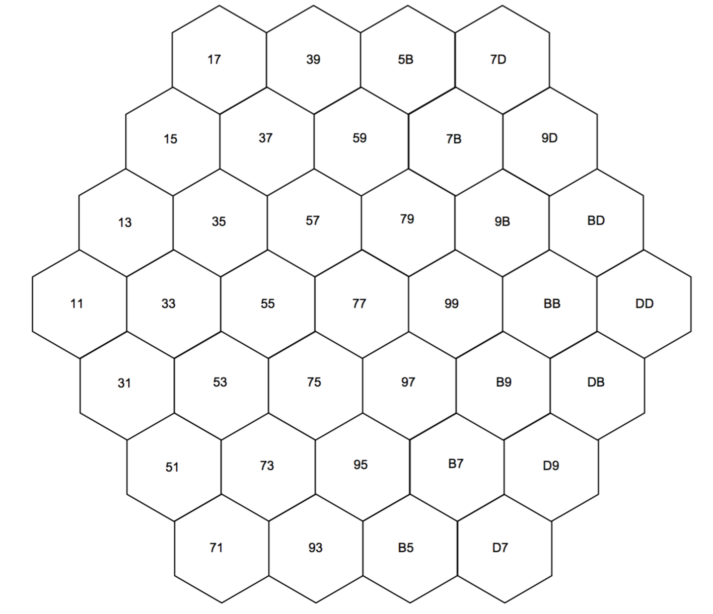
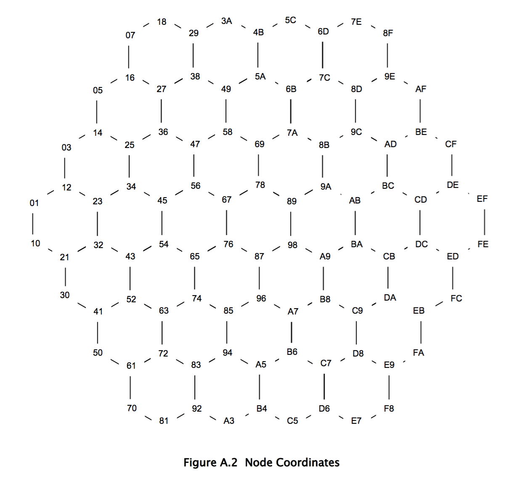
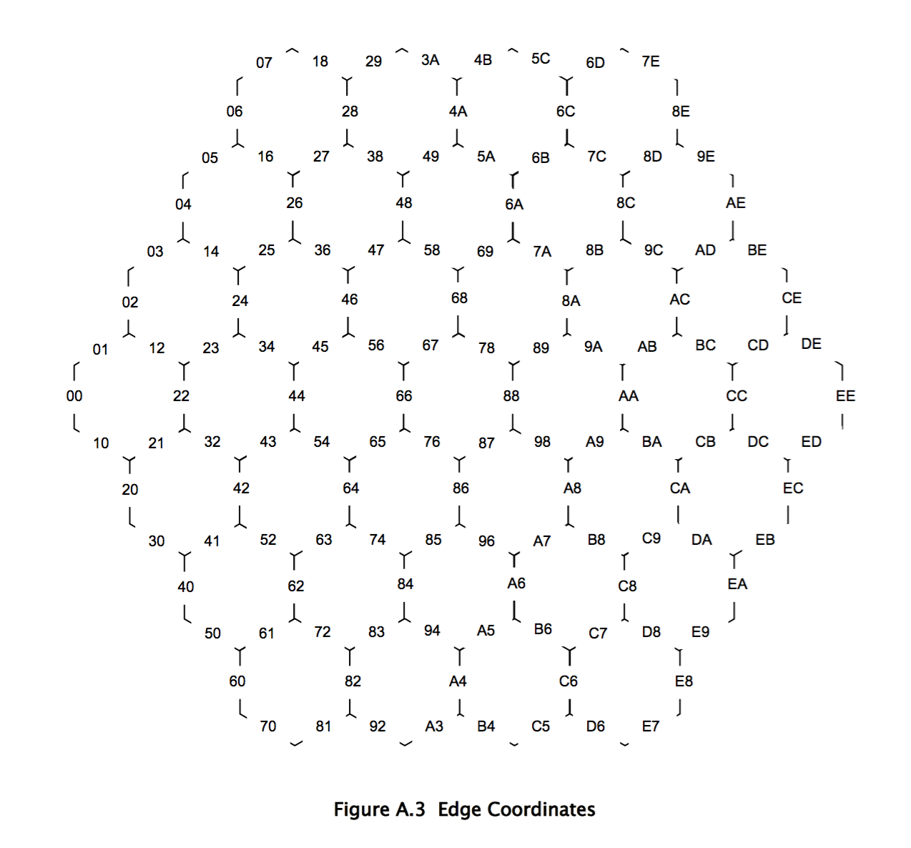

hexgrid
-------

Functions for working with a hexagonal settlers of catan grid

This module implements the coordinate system described in Robert S. Thomas's PhD dissertation on 
JSettlers2, Appendix A. See the project at https://github.com/jdmonin/JSettlers2 for details.

Supports Python 3. Might work in Python 2.

See `hexgrid.py` for thorough documentation.

> Author: Ross Anderson ([rosshamish](https://github.com/rosshamish))

### Installation

```
pip install hexgrid
```

### Usage

See https://github.com/rosshamish/catan-spectator for extended usage.

The module is a soup of functions which compute various transforms on tile, node and edge coordinates.
Functions are well documented - read function names and docstrings in the code for more info.

### Coordinate System

The coordinate system is the one described in Robert S. Thomas's PhD dissertation on
JSettlers2, Appendix A. See the project at https://github.com/jdmonin/JSettlers2

The idea is that there are three things: tiles, nodes, and edges.

All three have integer coordinates.

Tiles also have identifiers, which range from 1 through 19.

The coordinates are such that it's easy to compute a tile, node, or edge's neighbours by adding and subtracting.
See the dissertation and/or the code for details.

### Maps

- Tile identifiers


- Tile coordinates



- Node coordinates



- Edge coordinates



### License

GPLv3
